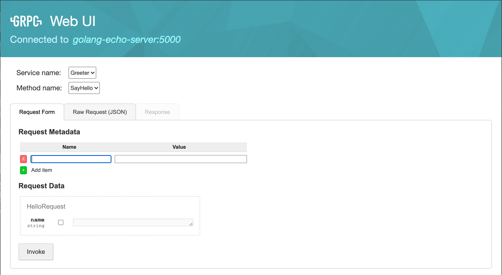
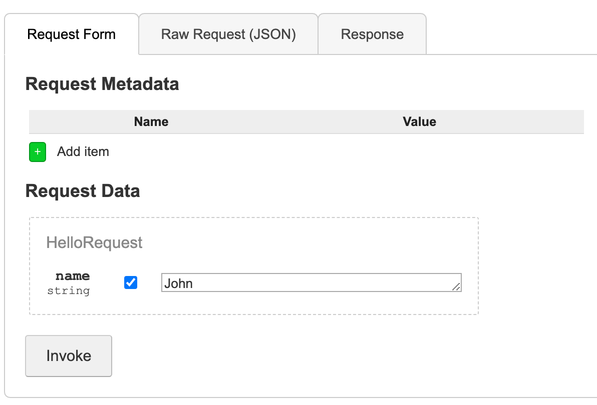

# golang-echo
This sample repository is an echo server with gRPC(protobuf) implemented with Golang.

## Survey
GolangでgRPCアプリケーションを開発するにあたって必要そうな知識を整理する
### gRPC
 - gRPCはGoogle謹製のHTTP/2を利用したRPC(Remote Produce Call)フレームワーク
 - データのシリアライズにはProtocol Buffersを利用する(Protocol Buffers以外も利用可能だがデファクトスタンダード)
 - RPCとしては他にREST-APIなどがあるが，REST-APIのようにパスやメソッドなどを指定する必要がなく注目されている


gRPCの全体像([http://www.grpc.io/docs/](http://www.grpc.io/docs/)より転載)

### Protocol Buffers
 - Google製のデータをバイナリ形式にシリアライズするためのフォーマット．JSONの代替を目指しているそう
 - クライアント・サーバー間の通信やデータの永続化などに用いる
 - ```*.proto```ファイルに IDL(Interactive Data Language) でデータ構造を記述する
 - 様々な言語で対応する(Golang/Java/Python etc...)
 - シリアライズ・デシリアライズするためのコードが自動生成される(```protoc```コマンドでコンパイルする)
 - レポジトリは [protocolbuffers/protobuf](https://github.com/protocolbuffers/protobuf).
 最新バージョンは 3 (proto3)


Protocol Buffers利用フロー([https://www.apps-gcp.com/grpc-go/](https://www.apps-gcp.com/grpc-go/)より転載)

### Go Protocol Buffer Message API
 - Go Protocol Buffer Message APIとはGolang製アプリが Protocol Bufferを利用するためのもの．最近，仕様にAPIの刷新があったことと関連レポジトリが多いので整理
 - 2020/3/20 APIv2 がGo公式ブログで発表．これによりGoでもReflectionが使えるようになった．
 - APIv2 は後方互換性はないが，APIv1 は今後もずっとサポートを継続するそう
 - Protocol Buffer側のレポジトリは golang/protobuf から [protocolbuffers/protobuf-go](https://github.com/protocolbuffers/protobuf-go) に移行．Protocol Buffersのメッセージやシリアライズに```protoc-gen-go```コマンドを利用
 - gPRC側のレポジトリの [grpc/grpc-go](https://github.com/grpc/grpc-go) に新たに```protoc-gen-go-grpc```コマンドができた．gPRCのサーバ/クライアントに用いるインターフェース(スタブコード)を生成ためにこのコマンドを利用
 - gRPCを利用したアプリの作成には上記の両方のコマンドが必要

**対応表**

|対象|APIv1|APIv2|
|:--|:--|:--|
|import のパス|github.com/golang/protobuf|google.golang.org/protobuf|
|ソースのリポジトリ|https://github.com/golang/protobuf|https://github.com/protocolbuffers/protobuf-go|
|protoc-gen-go|github.com/golang/protobuf/protoc-gen-go|google.golang.org/protobuf/cmd/protoc-gen-go|
|gRPCスタブコード生成|同上|google.golang.org/grpc/cmd/protoc-gen-go-grpc|

[Protocol Buffers用 Go言語APIの APIv1 と APIv2 の差異](https://qiita.com/kitauji/items/bab05cc8215abe8a6431)より転載

### Third Party Library
 - [gogo/protobuf](https://github.com/gogo/protobuf) は公式の golang/protobuf を補完する非公式のライブラリ．2021/02現在APIv1にのみ対応．(Reflectionに対応していたがAPIv2で公式に対応されたので利用するメリットはない？)
 - [grpc-ecosystem/go-grpc-middleware](https://github.com/grpc-ecosystem/go-grpc-middleware) はinterceptorを集めたライブラリ．リクエストパラメータに依存しない共通処理(具体的には認証・ログ・バリデーション・監視など）をintercept(傍受，途中で捕える)できる機構がgRPCのinterceptor
 - [gRPC command line tool](https://github.com/grpc/grpc/blob/master/doc/command_line_tool.md) はコマンドラインでgRPCを呼び出すためのコマンド(gRPCはcurl等で手軽に動作確認できないため)
 - [gRPCurl](https://github.com/fullstorydev/grpcurl) は同上のCLIツール．4.5kスター(2021/02時点)．他にもgRPCのクライアントCLIツールはたくさんある模様. [gRPC の CUI のクライアントツールを調べてまとめてみた](https://www.techscore.com/blog/2019/09/26/grpc-cui-client-tools/)

## How to use

[Protocol Buffers: ざっくりとした入門](https://qiita.com/kitauji/items/fdbd052c19dad28ab067) や [いまさらだけどgRPCに入門したので分かりやすくまとめてみた](https://qiita.com/gold-kou/items/a1cc2be6045723e242eb) などに従いつつ，golang製サーバーがprotobufで書かれたスキーマで通信されている様子をみる．

### スキーマからstubコードの生成

スキーマ ```helloworld.proto``` を元に，```protoc``` でgolang向けのstubコードを生成する．

golang向けのstubコードの生成にはプラグイン(google.golang.org/protobuf/cmd/protoc-gen-go)が必要になるが，protocコマンドとそのプラグインがセットになった仮想環境```ghcr.io/tk42/protoc```イメージを使って，そのあたりの工程はスキップする．（便利！）

```
docker compose run protoc
```

```.proto```では生成されるパッケージの指定```go_packages```を指定しなければエラーになる．

protocの引数は```--go_grpc_out``` を含めることを忘れないようにする．これがないとスタブコードに```RegisterXXX``` が作成されない．

その他は[protocの使い方](https://christina04.hatenablog.com/entry/protoc-usage)を参照する

### 生成されたstubコードをサーバコードに埋め込む
生成されたスタブコードは ```proto/autogen/helloworld.pb.go``` に配置される．

このコードを```server/main.go```に埋め込み，呼び出すようにする．

### デモ
#### サーバーの起動
サーバ側は通常のgolangコンテナでビルド，実行を行う．

#### クライアントの起動
gRPC版の```curl```ともいうべきCLIツール ```grpcurl``` のWebフロントラッパー fullstorydev/grpcurl を仮想化されたイメージ wongnai/grpcui を利用して，ブラウザ経由でサーバとgRPC通信する．

#### デモを起動
```
docker compose up server client
```

そして，[http://0.0.0.0:5000/](http://0.0.0.0:5000/) へブラウザからアクセスする


試しに，リクエストとして ```name=John``` を送信すると…


レスポンスの ```message``` に ```Hello John``` が返される．


## 応用編
### スキーマの変更
 - [Proto3 Language Guide（和訳）](https://qiita.com/CyLomw/items/9aa4551bd6bb9c0818b6)
 - [Protocol Buffers Proto3 文法 早めぐり](https://blog1.mammb.com/entry/2019/10/03/212044)

### JSON にしたい
 - [gRPCのシリアライゼーション形式をJSONにする](https://qiita.com/yugui/items/238dcdb75cd40d0f1ece)


### Reference
 - [gRPCって何？](https://qiita.com/oohira/items/63b5ccb2bf1a913659d6)
 - [Protocol Buffers用 Go言語APIの APIv1 と APIv2 の差異](https://qiita.com/kitauji/items/bab05cc8215abe8a6431)
 - [Go言語でのgRPCコード生成(2020年10月以降版)](https://note.com/dd_techblog/n/nb8b925d21118)
 - [GoGo Protobufのメリット・デメリット](https://christina04.hatenablog.com/entry/gogo-protobuf-merit-demerit)
 - [go-grpc-middlewareを一通り試してみる](https://qiita.com/Morix1500/items/7a20d76a931af68d860d)
 - [Go + gRPCで開発を始められるDockerfileを作る](https://qiita.com/keitakn/items/434091ff488296951ab6)
